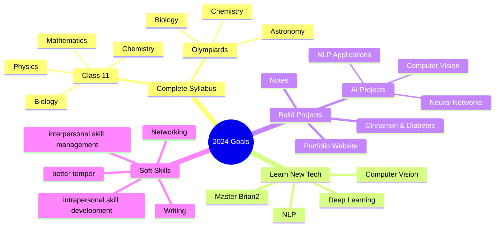

<div align="center">

```

███╗   ███╗██╗   ██╗██╗  ████████╗██╗      ███████╗██╗      █████╗  ██████╗██╗  ██╗███████╗██████╗
████╗ ████║██║   ██║██║  ╚══██╔══╝██║      ██╔════╝██║     ██╔══██╗██╔════╝██║ ██╔╝██╔════╝██╔══██╗
██╔████╔██║██║   ██║██║     ██║   ██║█████╗███████╗██║     ███████║██║     █████╔╝ █████╗  ██████╔╝
██║╚██╔╝██║██║   ██║██║     ██║   ██║╚════╝╚════██║██║     ██╔══██║██║     ██╔═██╗ ██╔══╝  ██╔══██╗
██║ ╚═╝ ██║╚██████╔╝███████╗██║   ██║      ███████║███████╗██║  ██║╚██████╗██║  ██╗███████╗██║  ██║
╚═╝     ╚═╝ ╚═════╝ ╚══════╝╚═╝   ╚═╝      ╚══════╝╚══════╝╚═╝  ╚═╝ ╚═════╝╚═╝  ╚═╝╚══════╝╚═╝  ╚═╝


```
# Hi there! I'm Satvik 👋

[](YOUR_LINK)

</div>

## 🚀 About Me


```ruby
class Developer
  attr_accessor :name, :role, :languages, :interests, :current_project

  def initialize
    @name = "Satvik Anand"
    @role = "Student & Developer"
    @languages = ["Python", "JavaScript", "Rust"]
    @interests = ["AI/ML", "Neuroscience", "Open Source"]
    @current_project = "Building something awesome!"
  end

  def say_hi
    puts "Thanks for dropping by! Let's build something amazing together!"
  end
end

me = Developer.new
me.say_hi
```

## 🛠️ Tech Stack

### Languages


### AI & Data Science Tools


### Frameworks & Tools


## 📊 GitHub Stats

<div align="center">


</div>

## 🏆 GitHub Trophies
<div align="center">


</div>

## 🎯 Weekly Development Breakdown

<div align="center">

<!--START_SECTION:waka-->

<!--END_SECTION:waka-->
</div>

## 🌟 Featured Projects

NONE FOR NOW

## 🎯 Current Goals



## 🐍 Contribution Graph


## 📫 Let's Connect!

<div align="center">

[](https://www.linkedin.com/in/satvik64/)
[](https://dirtbag128.github.io/notes-and-such/)
[](mailto:anandsatvik11313@gmail.com)
[](https://discord.com/channels/@me/699269054774509660)

</div>

---

<div align="center">

### 👀 Profile Views


### 🎵 My Music Corner

<div align="center">

[](https://music.youtube.com/@satvik1024)
[](https://www.last.fm/user/satvik64)


</div>

<details>
<summary>✨ Fun Facts</summary>
<br>

- 🌱 I'm currently learning Brian2 and Neural Networks
- 💬 Ask me about AI and Neuroscience
- ⚡ Fun fact: I am not fun
- 🎮 When not coding: studying

</details>

</div>

```
                  Never Give Up !
```
