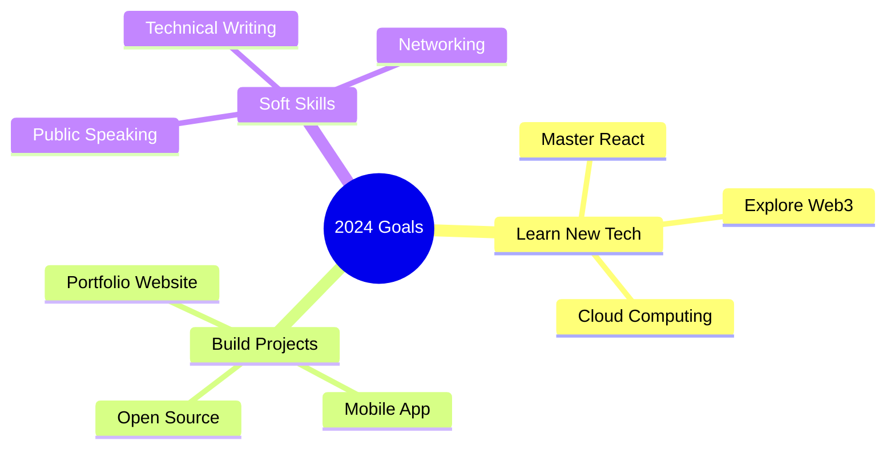

<div align="center">

```

__          ___ _         _______ _ _ _                                       _ _                                            _
\ \        / (_) |       |__   __(_) | |                                     ( ) |                                          | |
 \ \  /\  / / _| |_ ___     | |   _| | |  _   _  ___  _   _    ___ __ _ _ __ |/| |_   _ __   ___    _ __ ___   ___  _ __ ___| |
  \ \/  \/ / | | __/ _ \    | |  | | | | | | | |/ _ \| | | |  / __/ _` | '_ \  | __| | '_ \ / _ \  | '_ ` _ \ / _ \| '__/ _ \ |
   \  /\  /  | | ||  __/    | |  | | | | | |_| | (_) | |_| | | (_| (_| | | | | | |_  | | | | (_) | | | | | | | (_) | | |  __/_|
    \/  \/   |_|\__\___|    |_|  |_|_|_|  \__, |\___/ \__,_|  \___\__,_|_| |_|  \__| |_| |_|\___/  |_| |_| |_|\___/|_|  \___(_)
                                           __/ |
                                          |___/

```

# Hi there! I'm Satvik 👋

[](YOUR_LINK)

</div>

## 🚀 About Me

```python
class Developer:
    def __init__(self):
        self.name = "Satvik Anand"
        self.role = "Student & Developer"
        self.languages = ["Python", "JavaScript", "Rust"]
        self.interests = ["Web Development", "AI", "Open Source",""]
        self.current_project = "Building something awesome!"

    def say_hi(self):
        print("Thanks for dropping by! Let's build something amazing together!")

me = Developer()
me.say_hi()
```

## 🛠️ Tech Stack

### Languages


### Frameworks & Tools


## 📊 GitHub Stats

<div align="center">


</div>

## 🌟 Featured Projects

NONE FOR NOW

## 🎯 Current Goals



## 🐍 Contribution Graph


## 📫 Let's Connect!

<div align="center">

[](satvik64)
[](YOUR_WEBSITE)
[](mailto:anandsatvik11313@gmail.com)

</div>

---

<div align="center">

### 👀 Profile Views


### 🎵 Currently Listening To

### 🎵 My Music Corner

<div align="center">

[](https://music.youtube.com/@satvik1024)
[](https://www.last.fm/user/satvik64)


</div>

<details>
<summary>✨ Fun Facts</summary>
<br>

- 🌱 I'm currently learning Brian2
- 💬 Ask me about Moving out
- ⚡ Fun fact: I am not fun
- 🎮 When not coding: studying

</details>

</div>

```
                      Keep Coding! 🚀
```
