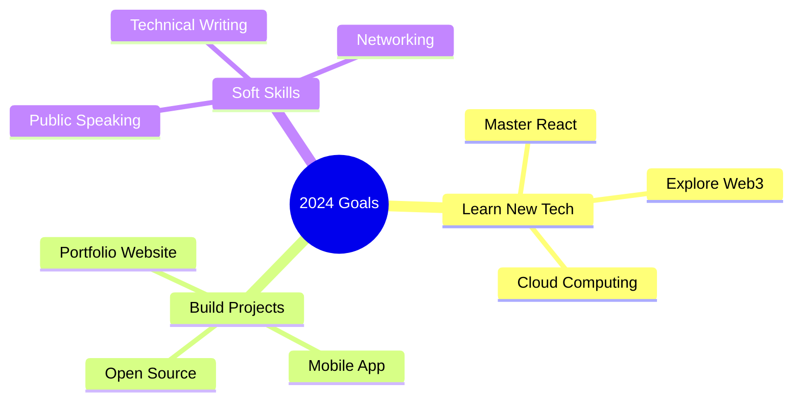

<div align="center">

```
   _____ _                 _     __   __          
  / ____| |               | |    \ \ / /          
 | |    | |__   ___   ___| | __  \ V / ___  _   _ 
 | |    | '_ \ / _ \ / __| |/ /   > < / _ \| | | |
 | |____| | | | (_) | (__|   <   / . \ (_) | |_| |
  \_____|_| |_|\___/ \___|_|\_\ /_/ \_\___/ \__, |
                                             __/ |
                                            |___/  
```

# Hi there! I'm [Your Name] 👋

[](YOUR_LINK)

</div>

## 🚀 About Me

```python
class Developer:
    def __init__(self):
        self.name = "[Your Name]"
        self.role = "Student & Developer"
        self.languages = ["Python", "JavaScript", "Java"]
        self.interests = ["Web Development", "AI", "Open Source"]
        self.current_project = "Building something awesome!"
        
    def say_hi(self):
        print("Thanks for dropping by! Let's build something amazing together!")

me = Developer()
me.say_hi()
```

## 🛠️ Tech Stack

### Languages


### Frameworks & Tools


## 📊 GitHub Stats

<div align="center">
  


</div>

## 🌟 Featured Projects

<div align="center">

[](https://github.com/YOUR_USERNAME/YOUR_REPO)
[](https://github.com/YOUR_USERNAME/YOUR_REPO)

</div>

## 🎯 Current Goals



## 🐍 Contribution Graph


## 📫 Let's Connect!

<div align="center">

[](YOUR_LINKEDIN)
[](YOUR_TWITTER)
[](YOUR_WEBSITE)
[](mailto:your.email@example.com)

</div>

---

<div align="center">

### 👀 Profile Views


### 🎵 Currently Listening To

[](YOUR_SPOTIFY_PROFILE)

<details>
<summary>✨ Fun Facts</summary>
<br>

- 🌱 I'm currently learning [Technology]
- 💬 Ask me about [Your Expertise]
- ⚡ Fun fact: [Interesting Fact About You]
- 🎮 When not coding: [Your Hobbies]

</details>

</div>

```
                      Keep Coding! 🚀
```
