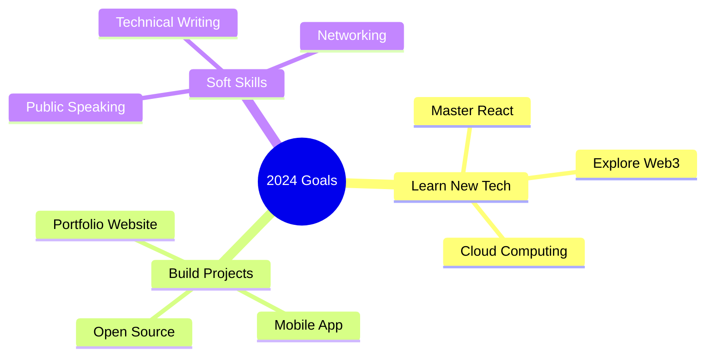

<div align="center">

```

o              o     o     o                       ____o__ __o____    o     o    o                                                                                     o/   o                                                                                              o
<|>            <|>  _<|>_  <|>                       /   \   /   \   _<|>_  <|>  <|>                                                                                   /v   <|>                                                                                            <|>
/ \            / \         < >                            \o/               / \  / \                                                                                  />    < >                                                                                            / \
\o/            \o/    o     |        o__  __o              |           o    \o/  \o/       o      o     o__ __o     o       o           __o__    o__ __o/  \o__ __o          |          \o__ __o     o__ __o        \o__ __o__ __o     o__ __o    \o__ __o     o__  __o    \o/
|              |    <|>    o__/_   /v      |>            < >         <|>    |    |       <|>    <|>   /v     v\   <|>     <|>         />  \    /v     |    |     |>         o__/_       |     |>   /v     v\        |     |     |>   /v     v\    |     |>   /v      |>    |
< >            < >   / \    |      />      //              |          / \   / \  / \      < >    < >  />       <\  < >     < >       o/        />     / \  / \   / \         |          / \   / \  />       <\      / \   / \   / \  />       <\  / \   < >  />      //    < >
\o    o/\o    o/    \o/    |      \o    o/                o          \o/   \o/  \o/       \o    o/   \         /   |       |       <|         \      \o/  \o/   \o/         |          \o/   \o/  \         /      \o/   \o/   \o/  \         /  \o/        \o    o/
 v\  /v  v\  /v      |     o       v\  /v __o            <|           |     |    |         v\  /v     o       o    o       o        \\         o      |    |     |          o           |     |    o       o        |     |     |    o       o    |          v\  /v __o    o
  <\/>    <\/>      / \    <\__     <\/> __/>            / \         / \   / \  / \         <\/>      <\__ __/>    <\__ __/>         _\o__</   <\__  / \  / \   / \         <\__       / \   / \   <\__ __/>       / \   / \   / \   <\__ __/>   / \          <\/> __/>  _<|>_
                                                                                             /
                                                                                            o
                                                                                         __/>

```

# Hi there! I'm [Your Name] 👋

[](YOUR_LINK)

</div>

## 🚀 About Me

```python
class Developer:
    def __init__(self):
        self.name = "Satvik Anand"
        self.role = "Student & Developer"
        self.languages = ["Python", "JavaScript", "Rust"]
        self.interests = ["Web Development", "AI", "Open Source",""]
        self.current_project = "Building something awesome!"

    def say_hi(self):
        print("Thanks for dropping by! Let's build something amazing together!")

me = Developer()
me.say_hi()
```

## 🛠️ Tech Stack

### Languages


### Frameworks & Tools


## 📊 GitHub Stats

<div align="center">


</div>

## 🌟 Featured Projects

<div align="center">

[](https://github.com/dirtbag128/YOUR_REPO)
[](https://github.com/dirtbag128/YOUR_REPO)

</div>

## 🎯 Current Goals



## 🐍 Contribution Graph


## 📫 Let's Connect!

<div align="center">

[](YOUR_LINKEDIN)
[](YOUR_TWITTER)
[](YOUR_WEBSITE)
[](mailto:your.email@example.com)

</div>

---

<div align="center">

### 👀 Profile Views


### 🎵 Currently Listening To

[](YOUR_SPOTIFY_PROFILE)

<details>
<summary>✨ Fun Facts</summary>
<br>

- 🌱 I'm currently learning [Technology]
- 💬 Ask me about [Your Expertise]
- ⚡ Fun fact: [Interesting Fact About You]
- 🎮 When not coding: [Your Hobbies]

</details>

</div>

```
                      Keep Coding! 🚀
```
